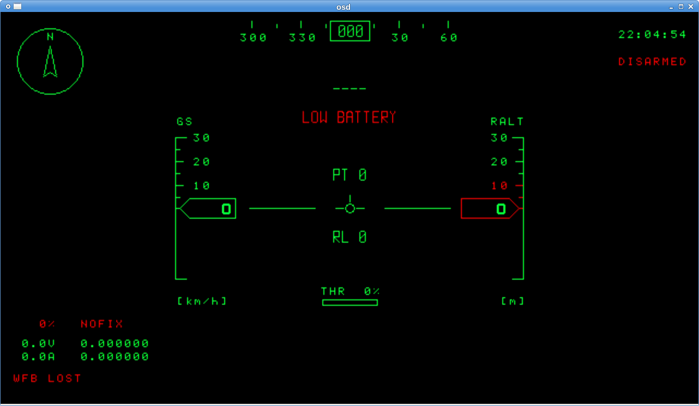
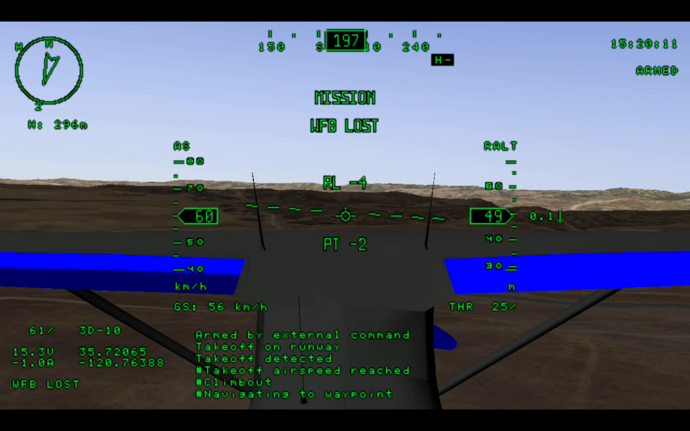

This project started from https://github.com/TobiasBales/PlayuavOSD.git

Supported platforms:
-------------------
  * Raspberry Pi 0-3 -- use hardware overlay mode (OpenVG)
  * Any other Linux with X11 or Wayland -- use GStreamer OpenGL mixer

Supported autopilots:
---------------------

   * PX4 -- full support
   * Ardupilot -- should work, but not tested
   * any mavlink-based -- should work with small fixes

Building:
---------

1. Build for Linux (X11 or Wayland) (native build):
  * `apt-get install  gstreamer1.0-tools libgstreamer1.0-dev gstreamer1.0-plugins-base gstreamer1.0-plugins-bad gstreamer1.0-plugins-good gstreamer1.0-plugins-ugly libgstreamer-plugins-base1.0-dev`
  * `make osd`

2. Build for Raspberry PI 0-3 (OpenVG) (native build):
  * `make osd mode=rpi`

Running:
--------

Default mavlink port is UDP 14551.
Default RTP video port is UDP 5600.

   * Run `./osd`
   * You should got screen like this:
     

Screenshots:
------------

